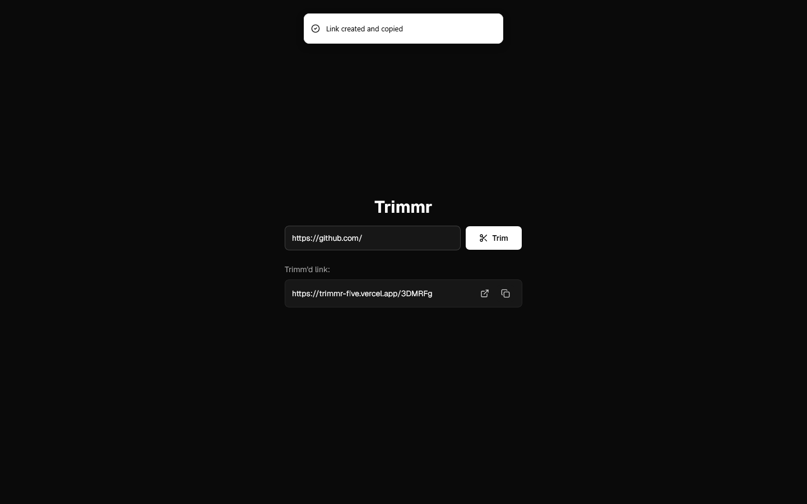

# Trimmr

A simple URL shortener built with Next.js and Supabase.

Live Site URL: [Click Me](https://trimmr-five.vercel.app/)
  
## Features
- Shortens long URLs
- Redirects using short codes
- Copy shortened link
- Basic URL validation

## Tech Stack
- Next.js (App Router)
- Supabase (Postgres)
- Tailwind CSS

## API

### POST /api/shorten
Creates a short URL.

```jsx
Body:
{
  "url": "https://example.com"
}

Returns:
{
  "shortUrl": "abc123"
}
```
### GET /[code]
Redirects to original URL.

## Notes
- Demo deployment uses Vercel subdomain
- No custom domain configured
